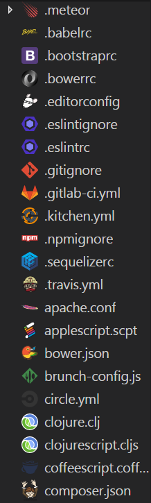
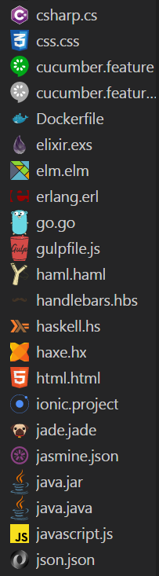
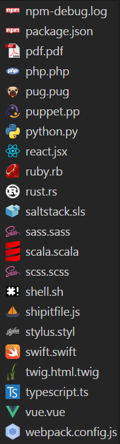

# Logo File Icons for Visual Studio Code

A icon theme for VS Code. The icons are from [logo-file-icons](https://github.com/manuelbieh/logo-file-icons).

## Screenshot

## Installation
1. clone this repository
2. move the folder downloaded to your local extensions folder:

* Windows: `%USERPROFILE%\.vscode\extensions`
* Mac/Linux: `$HOME/.vscode/extensions`

## License
MIT License.

**Enjoy!**